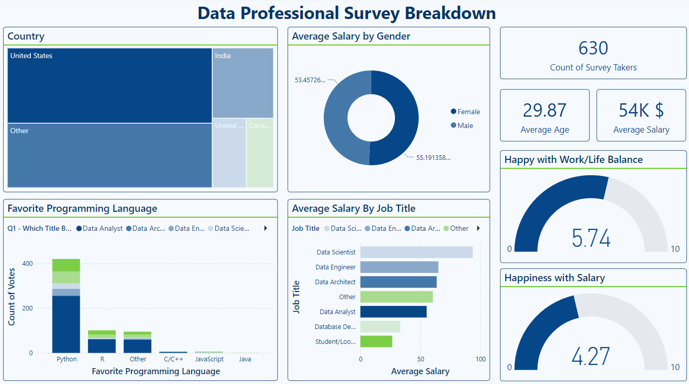

<h1 align="center">
    :school_satchel: Data Professional Survey Breakdown - Dashboard in Power BI
       
      

     📊 Data Visualization
</h1> 
<h3>📚 About Data</h3>

Data Survey collected by Alex The Analys from his students.

📍 The dataset is available via the following link: <a href="https://github.com/AlexTheAnalyst/Power-BI/blob/main/Power%20BI%20-%20Final%20Project.xlsx">Kaggle Link</a>.
<h3>📌 Objectives</h3>

Using Power BI, a dashboard was created to visualize: 

<ul>
  <li><b>Total Survey Takers</b></li>
  <li><b>Average Age</b></li>
  <li><b>Average Salary</b></li>
  <li><b>Country of the students</b></li>
  <li><b>Favorite Programming Language used by students</b></li>
  <li><b>Average Salary by Gender</b></li>
  <li><b>Average Salary by Job</b></li>
  <li><b>Average of Happiness Balance between Work and Life</b></li>
  <li><b>Average of Happiness with Current Salary</b></li>
</ul>

<h3>Conclusion</h3>

<b>Demographics and Salary:</b> The average participant is 29.87 years old, earning an average salary of $54,000. Males earn slightly more ($55,191) than females ($53,457).

<b>Geographic Distribution:</b> Most participants are from the United States, with India and Canada also contributing significantly.

<b>Programming Language Preferences:</b> Python dominates as the favorite programming language, far surpassing others like R and C/C++.

<b>Job Roles and Salaries:</b> Data Scientists earn the highest salaries, followed by Data Engineers and Data Architects, while Students/Learners and Database Developers earn the least.

<b>Satisfaction Levels:</b> Work-life balance is moderately rated (5.74/10), but salary satisfaction is lower (4.27/10), indicating potential concerns about compensation.

